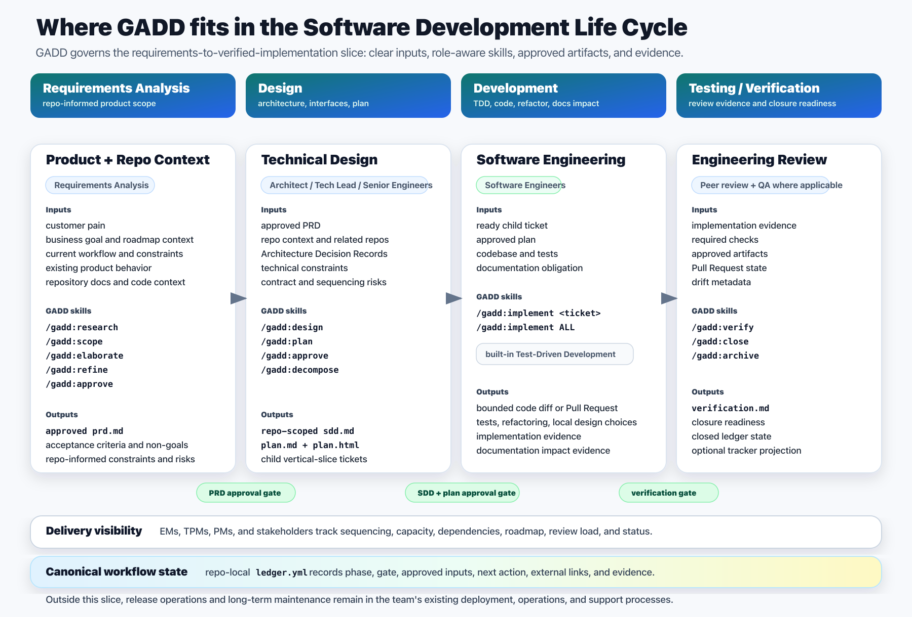

# GADD [](https://skills.sh/awjreynolds/gadd)

GADD is a governed autonomy methodology for AI-assisted software delivery.

It keeps autonomous agent work inside explicit role, scope, evidence, and approval boundaries from requirements to verified implementation. The repo-local `ledger.yml` remains canonical; planning and review systems are projection surfaces.

## Installation

```bash
npx skills add awjreynolds/gadd
```

List the available skills without installing:

```bash
npx skills add awjreynolds/gadd --list
```

Install every GADD skill non-interactively:

```bash
npx skills add awjreynolds/gadd --all -y
```

## Available Skills

- `/gadd:setup` - Bootstrap GADD config, templates, ticket directories, and optional external projection settings.
- `/gadd:next` - Read repo-local ledger state and report the next command or human action.
- `/gadd:research` - Gather sanitized product and repo evidence before scoping.
- `/gadd:scope` - Define Product Requirement scope boundaries.
- `/gadd:elaborate` - Fill product detail inside approved scope.
- `/gadd:refine` - Prepare the PRD for engineering handoff and approval.
- `/gadd:approve` - Approve exactly one PRD, SDD, or plan gate.
- `/gadd:design` - Create or update the repo-scoped SDD.
- `/gadd:plan` - Create the implementation plan and review copy.
- `/gadd:decompose` - Turn an approved plan into vertical-slice child tickets.
- `/gadd:implement` - Implement one ready child ticket, or all ready child tickets, with code and tests.
- `/gadd:verify` - Verify implemented child work before closure.
- `/gadd:close` - Apply human-approved workflow closure.
- `/gadd:archive` - Optionally archive already-closed local ticket packages.

## Workflow



GADD governs the SDLC slice from Requirements Analysis through Testing / Verification. It does not claim to own enterprise planning, deployment operations, or long-term maintenance; it keeps AI-assisted delivery inside clear handoffs from approved requirements to verified implementation.

## Templates

The setup templates are bundled with the `gadd-setup` skill under `skills/gadd-setup/assets/templates/`. When `/gadd:setup` runs in a target repository, it copies those templates into that repository's `.gadd/templates/` directory.

## More Detail

- [docs/workflow.md](docs/workflow.md) covers workflow state, external projections, the MVP workflow, and handoff artifact contracts.
- [docs/skills.md](docs/skills.md) catalogs the `/gadd:*` skills by lane, purpose, input, output, and usual handoff.
- [docs/package-model.md](docs/package-model.md) covers package layout and compatibility surfaces.

## Support

Search existing issues or open a new issue in the [GitHub issue tracker](https://github.com/awjreynolds/gadd/issues).

## Validate This Repo

```bash
./scripts/validate-gadd-mvp.sh
```
