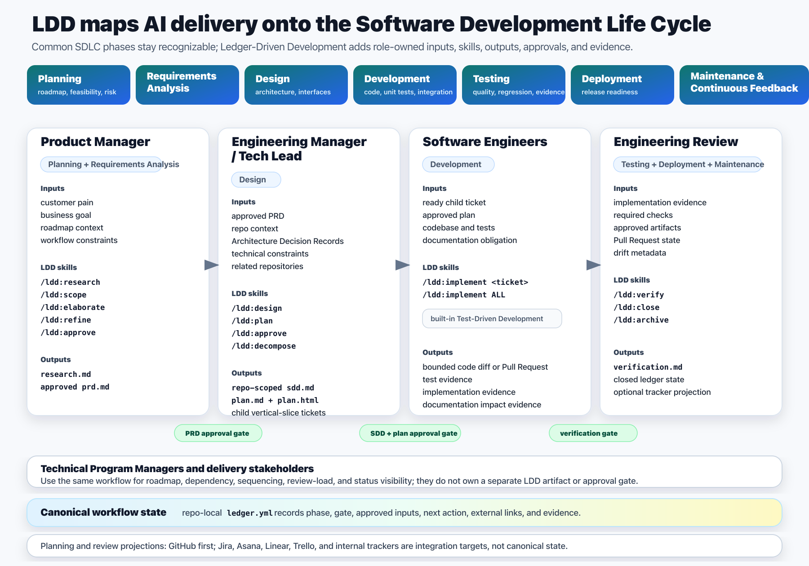

# Ledger-Driven Development

Enterprise teams can use Artificial Intelligence (AI) agents for real software delivery without giving up Software Development Life Cycle (SDLC) governance, role ownership, roadmap visibility, review discipline, or multi-repo control.

Ledger-Driven Development (LDD) is an AI-native workflow for product and engineering teams. It turns agent work into explicit SDLC handoffs: product scope, technical design, implementation planning, vertical-slice implementation, verification, and closure. The repo-local `ledger.yml` remains canonical; planning and review systems are projection surfaces.

## Why LDD Exists

AI agents are powerful, but chat-first delivery is a poor enterprise control plane.

In a maverick chat/task loop, one prompt can quietly become product scope, technical design, implementation plan, test strategy, documentation policy, and closure decision. Product Manager (PM), Engineering Manager (EM), Tech Lead, Software Engineer (SE), Quality Assurance (QA), and Technical Program Manager (TPM) responsibilities blur. Scope grows in the conversation. Planning systems drift. Reviewers end up asking "what happened?" instead of reviewing the intended handoff.

LDD keeps the useful part of AI acceleration while putting the work back into recognizable SDLC boundaries:

- product scope stays separate from engineering design
- technical decisions are reviewed before implementation planning
- implementation happens as bounded vertical slices
- verification and closure are separate gates
- business planning systems stay visible without becoming the hidden source of truth
- multi-repo impact can be discovered without turning design into one unbounded cross-repo blob

## What LDD Changes

| Enterprise risk | LDD response |
| --- | --- |
| Agent chat becomes the source of truth | Repo-local `ledger.yml` records phase, gate, approved inputs, next action, external links, and evidence. |
| Scope creep hides inside implementation | Product Requirements Document (PRD), Software Design Document (SDD), plan, decomposition, implementation, verification, and closure are separate handoffs. |
| AI jumps straight to code | `/ldd:implement` uses a built-in Test-Driven Development (TDD) loop: write a focused failing test, make it pass, refactor, then rerun broader checks. |
| Existing planning tools go stale | External systems are managed projections for roadmap, review, and status visibility. |
| Multi-repo work becomes unbounded | LDD is multi-repo aware, but SDDs and plans stay repo-scoped. |
| Reviewers lack evidence | Implementation, documentation impact, verification, and closure evidence are recorded explicitly. |



The visualization uses common SDLC phase terminology: Planning, Requirements Analysis, Design, Development, Testing, Deployment, and Maintenance with Continuous Feedback. LDD adds explicit role-owned handoffs, artifacts, skills, approval gates, and evidence without renaming the lifecycle.

## Workflow By Role

LDD is designed for teams where different people own different SDLC decisions. The agent can assist each phase, but it should not collapse ownership into one task loop.

| Role | Inputs | LDD skills | Outputs |
| --- | --- | --- | --- |
| Product Manager | Customer pain, business goal, roadmap context, current workflow, constraints | `/ldd:research`, `/ldd:scope`, `/ldd:elaborate`, `/ldd:refine`, `/ldd:approve` | `research.md`, approved `prd.md` |
| Engineering Manager / Tech Lead | Approved PRD, repo context, Architecture Decision Records (ADRs), technical constraints, related repositories | `/ldd:design`, `/ldd:plan`, `/ldd:approve`, `/ldd:decompose` | repo-scoped `sdd.md`, `plan.md`, `plan.html`, child vertical-slice tickets |
| Software Engineers | Ready child ticket, approved plan, codebase, tests, documentation obligation | `/ldd:implement <ticket>`, `/ldd:implement ALL` with built-in Test-Driven Development | bounded code diff or Pull Request (PR), test evidence, implementation evidence, documentation impact evidence |
| Engineering Review | Implementation evidence, required checks, approved artifacts, PR state, drift metadata | `/ldd:verify`, `/ldd:close`, `/ldd:archive` | `verification.md`, closed ledger state, optional external tracker projection |

Technical Program Managers and delivery stakeholders are first-class consumers of the workflow. They need dependency, sequencing, roadmap, review-load, and status visibility, but the current LDD command model does not define a TPM-owned artifact or approval gate.

## Shared Utilities

Some LDD skills support every participant rather than owning one SDLC artifact:

- `/ldd:next` is read-only workflow navigation. It reports the next command, next human action, reason, and blocker from repo-local ledger state.
- `/ldd:setup` bootstraps a target repository with ledger config, templates, draft/archive directories, and optional external projection settings.
- Visible session progress is recommended agent User Experience (UX) when the host agent supports it. It helps humans see what the agent is doing, but it never replaces `ledger.yml`, approval evidence, verification, or closure state.

## Multi-Repo Aware, Repo-Scoped Design

LDD can reason about product work that affects more than one repository. Research and design may inspect related repositories and code-intelligence evidence when available.

The boundary is deliberate: Product Requirements can be multi-repo aware, but SDDs are repo-scoped. Each affected repository needs its own design and plan boundary so ownership, implementation, review, verification, and closure remain concrete.

That distinction keeps multi-repo work coordinated without turning one agent task into an unbounded cross-repo implementation.

## Planning-System Projections

Enterprise delivery already lives in planning and review systems. LDD should meet teams there without making those systems canonical workflow state.

The long-term model is adaptive projection: LDD should be able to target the planning system your organization already uses (GitHub Issues, Jira, Asana, Linear, Trello, or an internal tracker), learn the available Application Programming Interface (API) surface, and propose the safest projection model. Today, the documented dogfooding path is GitHub-first, and the repo-local ledger remains canonical.

Current maturity:

| Surface | Status |
| --- | --- |
| Local ledger | Canonical and always supported |
| GitHub | First dogfooding path for issues, sub-issues, and Pull Request review projections |
| Linear | Important planning surface, not validated support yet |
| Jira | Important enterprise planning surface, not validated support yet |
| Asana | Candidate roadmap/cross-functional planning surface, not validated support yet |
| Trello and internal trackers | Adaptive projection examples, not validated support yet |

Do not treat external trackers as LDD's source of truth. External mutations require explicit human confirmation and drift checks.

## Commands

```text
/ldd:setup
/ldd:next
/ldd:research
/ldd:scope
/ldd:elaborate
/ldd:refine
/ldd:approve
/ldd:design
/ldd:plan
/ldd:decompose
/ldd:implement
/ldd:verify
/ldd:close
/ldd:archive
```

## Package Model

The canonical package manifest is `agent-skills.json`.

The canonical skill source is the Agent Skills layout:

```text
skills/<skill-name>/SKILL.md
skills/<skill-name>/assets/
skills/<skill-name>/agents/openai.yaml
```

`agent-skills.json` lists every installable skill path and adapter manifest. Adapter-specific files point back to the matching skill. They are not a second source of truth.

Adapter manifests make the same skills installable in specific agents:

| Agent | Adapter files |
| --- | --- |
| Codex | `skills/ldd-*`, `agents/openai.yaml`, `agent-skills.json` |
| Claude Code | `.claude-plugin/plugin.json`, `.claude-plugin/marketplace.json`, `skills/ldd-*` |
| Gemini Command-Line Interface (CLI) | `gemini-extension.json`, `GEMINI.md`, `commands/ldd/*.toml`, `skills/ldd-*` |

LDD skills are standalone. They must not require other installed skills such as external Test-Driven Development, issue-generation, planning, triage, or debugging skills. A host agent may provide helpful tools, but every `/ldd:*` command must carry its own workflow contract.

The current workflow design is `docs/superpowers/specs/2026-05-12-local-ledger-mvp-design.md`. Supplemental design notes capture the GitNexus code-intelligence contract and documentation freshness contract. Older GitHub-ledger specs remain as historical context only.

## Install

### Codex

Use `$skill-installer` from inside Codex and ask it to install the skills listed by `agent-skills.json`:

```text
Use $skill-installer to install all skills from
https://github.com/awjreynolds/ledger-driven-development
using agent-skills.json.
```

Until the stock installer reads `agent-skills.json` directly, install the paths in that manifest:

```text
skills/ldd-setup
skills/ldd-next
skills/ldd-research
skills/ldd-scope
skills/ldd-elaborate
skills/ldd-refine
skills/ldd-approve
skills/ldd-design
skills/ldd-plan
skills/ldd-decompose
skills/ldd-implement
skills/ldd-verify
skills/ldd-close
skills/ldd-archive
```

Installed Codex skills are local copies under `~/.codex/skills`. They are not live-linked to this repository. To update, remove the installed `ldd-*` skills, reinstall from the current `agent-skills.json`, and restart Codex.

### Claude Code

Add this repository as a plugin marketplace, then install the plugin:

```text
/plugin marketplace add awjreynolds/ledger-driven-development
/plugin install ldd@ledger-driven-development
```

Restart Claude Code after installing.

### Gemini CLI

Install this repository as a Gemini CLI extension:

```sh
gemini extensions install https://github.com/awjreynolds/ledger-driven-development
```

Restart Gemini CLI after installing. The extension provides `commands/ldd/*.toml`, which map to `/ldd:setup`, `/ldd:next`, `/ldd:research`, `/ldd:scope`, `/ldd:elaborate`, `/ldd:refine`, `/ldd:approve`, `/ldd:design`, `/ldd:plan`, `/ldd:decompose`, `/ldd:implement`, `/ldd:verify`, `/ldd:close`, and `/ldd:archive`.

## Source Of Truth

- Workflow state: repo-local `ledger.yml` files in the target project.
- Skill package: `agent-skills.json`.
- Command behavior: `skills/ldd-*/SKILL.md`.
- Claude adapters: `commands/ldd/*.md`.
- Gemini adapters: `commands/ldd/*.toml` plus `GEMINI.md`.

External trackers are optional review and sync surfaces. They are not canonical LDD state.

GitNexus is the strongly recommended code-intelligence surface when code reality matters. LDD treats GitNexus as advisory evidence, not canonical workflow state. If GitNexus is unavailable, stale, unindexed, or outside the configured related repositories, commands continue with normal repository inspection and record the limitation.

GitHub is the first external-tracker dogfooding path:

- GitHub issues project PRD, SDD, and child work visibility.
- SDD issues are children of PRD issues; implementation child work issues created by decomposition are native GitHub sub-issues of the SDD issue when GitHub supports sub-issues, so a PRD issue may have implementation issue grandchildren.
- GitHub Pull Requests project implementation review.
- LDD updates managed GitHub bodies only after explicit human confirmation and drift checks.
- Linear and Jira remain follow-on optional collaboration surfaces until the GitHub model is proven.

## Minimum Viable Product (MVP) Workflow

```text
draft PRD ledger
  -> optional research
  -> promoted Product Requirement ticket
  -> PRD approval with /ldd:approve
  -> SDD/Plan
  -> child vertical-slice tickets
  -> implementation
  -> verification
  -> human-approved closure
  -> optional local archive cleanup
```

The repo-local `ledger.yml` is canonical. `/ldd:refine` commits the final PRD and routes PRD approval to `/ldd:approve <ticket-id>`. In local tracker mode, a promoted stable ticket directory such as `docs/tickets/LDD-0001-short-slug/` is the real ticket. In GitHub tracker mode, PRD approval creates or binds the GitHub Product Requirement issue first, then uses the GitHub issue number as the promoted ticket identifier (ID) and directory name. External trackers are synchronized only when configured and approved by the human.

New Product Requirements can be scoped while other promoted tickets are still in progress. `/ldd:scope` creates or updates the local draft ticket directory; incomplete promoted tickets do not block new draft PRDs. Local mode keeps one active draft, so starting another draft first requires continuing, renaming, promoting, or discarding the existing draft.

`/ldd:research` gathers PM-grade inputs before scoping when the trigger is weak, sensitive, or requires codebase investigation. Research has full read-only visibility into repository files, docs, existing LDD artifacts, GitNexus code-intelligence context when available, and human-supplied private/local context, but it writes only sanitized conclusions, codebase facts, explicit uncertainties, risks, sensitivity handling, open questions, and one readiness decision.

`/ldd:design` is the strongest GitNexus consumer. It strongly recommends GitNexus-backed discovery before deciding affected repositories, SDD boundaries, cross-repo sequencing, and contract risks. GitNexus is advisory: stale or unavailable indexes are recorded as limitations rather than blocking LDD unless a team policy or approved plan explicitly requires fresh GitNexus evidence.

PM commands use a bounded shared-understanding gate before a PRD can move forward. That gate keeps the useful part of grill-style questioning: the agent must prove it understands the user's intended boundary, blocker, and handoff criteria. It is bounded so the conversation does not absorb every related idea into the current PRD; weak inputs route to `/ldd:research`, new scope routes back to `/ldd:scope`, a later phase, or a separate PRD.

Every LDD phase has an input quality gate. A command must validate its source inputs before writing or mutating artifacts; when inputs fail the standard, it names the blocking gap and the earliest LDD command that can repair it.

## Handoff Artifacts

`/ldd:setup` installs templates into a target repository:

```text
.ldd/config.yml
.ldd/templates/ledger.yml
.ldd/templates/research.md
.ldd/templates/prd.md
.ldd/templates/sdd.md
.ldd/templates/plan.md
.ldd/templates/plan.html
.ldd/templates/issue-body-prd.md
.ldd/templates/issue-body-sdd.md
.ldd/templates/issue-body-child.md
.ldd/templates/pr-body-prd.md
.ldd/templates/pr-body-sdd-plan.md
.ldd/templates/pr-body-implementation.md
.ldd/templates/verification.md
docs/tickets/_drafts/
docs/tickets/_archive/
```

The templates are quality contracts, not blank forms:

- PRDs keep product scope separate from technical design.
- Research artifacts gather standard PM inputs, codebase facts, and sensitivity handling before scope without becoming product scope or engineering design.
- GitNexus is strongly recommended code intelligence for research, design, planning, and optional verification evidence; it never replaces the repo-local ledger.
- `/ldd:approve` records explicit human approval for PRD, SDD, and plan gates. It does not approve decomposition, closure, or external mutations.
- SDDs translate approved PRDs into designs grounded in code and ADRs.
- Plans trace acceptance criteria to implementation slices and verification.
- Plans and child tickets must record documentation impact for each slice: updated, not needed with reason, or blocked.
- Decomposition turns approved plan slices into child vertical-slice tickets.
- Implementation completes child work but does not close it. Implementation evidence must include documentation impact, changed documentation paths, or a direct docs-not-needed rationale.
- Verification checks child-ticket closure readiness before workflow close, including documentation impact for the implemented child work.
- Close applies verified closure, keeps local ticket paths stable, and can close a parent only when every child is verified and closeable. In GitHub mode, issue closure is an explicit external mutation recorded as evidence.
- Archive is optional storage cleanup for already-closed local ticket packages.
- External issue bodies are rich projections of the ledger and artifacts, readable without opening the repo.
- GitHub-first projections use issues for PRD, SDD, and child work visibility, native sub-issues for implementation child work where supported, and Pull Requests for implementation review while keeping the repo-local ledger canonical.
- Child tickets follow LDD's standalone independently-grabbable shape: parent, what to build, acceptance criteria, blockers, user stories covered, and LDD traceability.
- PR bodies focus reviewers on the correct handoff question.

## Validate This Repo

```sh
./scripts/validate-ldd-mvp.sh
```
