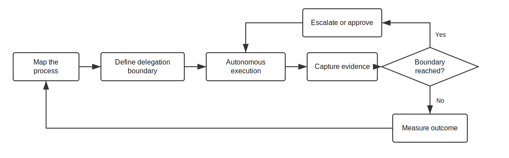

# Governed Autonomy

Governed Autonomy is a business-process discipline for the AI transformation era.

It starts from a simple idea: organizations can delegate more work to autonomous systems only when accountability, authority, scope, evidence, escalation, approval, and closure boundaries remain explicit.

Governed Autonomy is not a claim that business process management, Responsible AI, risk management, auditability, or operating model design are new. It is a practical lens for applying those existing disciplines when autonomous systems start performing work inside business processes.

## ELI5

Governed Autonomy means letting AI or automated systems help do work while making sure people still decide what matters, know what happened, can inspect the evidence, and approve important steps.

It is not "let the AI do everything." It is "decide what the AI may do, what it must prove, when it must stop, and who remains accountable."

## Why This Matters

AI transformation is often treated as task automation. That misses the larger risk: uncontrolled AI can change how work flows through an organization without accountable process control.

The better question is not "can AI do this task?" The better question is:

> Can this business process safely delegate this step under defined boundaries, with enough evidence, escalation, and approval?

That makes Governed Autonomy a synthesis, not a replacement for existing governance or process-improvement disciplines.

## The Business Process Is The Unit Of Design

Governed Autonomy is not tied to one industry. It applies wherever work moves through a process: approvals, case handling, compliance review, procurement, service requests, incident response, change management, planning, support, and internal operations.

The work is to understand the process, decide where autonomy can participate, and design the controls that keep humans accountable for purpose, risk, and outcome.

## What Must Stay Governed

- Purpose: what the process is trying to achieve.
- Authority: who or what is allowed to act.
- Scope: what is inside and outside the delegated work.
- Evidence: what must be recorded so decisions can be reviewed.
- Escalation: when the autonomous system must stop or ask for help.
- Approval: which transitions need explicit human consent.
- Closure: how completion is verified and accepted.

## Where GADD Fits

GADD is the first documented case study in this repository: a software-delivery methodology that applies Governed Autonomy to intake, requirements, design, planning, implementation, verification, and closure.

GADD does not define the full scope of Governed Autonomy. It shows how the philosophy becomes concrete in one complex business process.

## Read Next

- [Operating Model](operating-model.md)
- [Process Assessment](process-assessment.md)
- [Uncontrolled AI Risk Patterns](uncontrolled-ai-risk-patterns.md)
- [GADD Case Study](case-study-gadd.md)
- [Related Landscape](related-landscape.md)
- [References](references.md)
