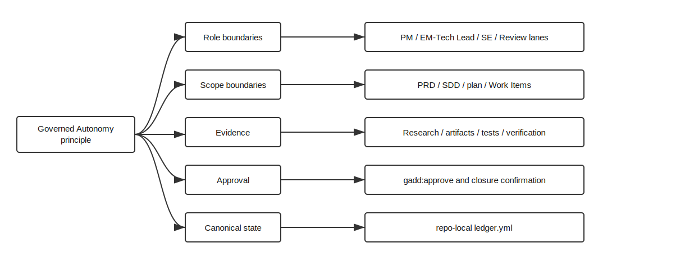

# Case study: GADD

GADD applies Governed Autonomy to software delivery: moving a unit of software work from unclassified intake through requirements, design, planning, implementation, verification, and closure, with explicit boundaries and human approval at the transitions that matter.

It's one process. Governed Autonomy is broader. GADD is the version that exists in code in this repository, and the rest of this page maps how the abstract pieces show up in the concrete system.

## Business process

The process covered is software delivery, from unclassified intake through requirements, design, planning, implementation, verification, closure, and optional archive cleanup.

## Roles

| Governed Autonomy concern | GADD expression |
| --- | --- |
| Process owner | Team or organization adopting GADD |
| Product authority | Product Manager and Product Requirement lane |
| Technical authority | EM, Tech Lead, Architect, and Technical Design lane |
| Operator | Software Engineer and `/gadd:implement` |
| Reviewer | Engineering Review and `/gadd:verify` |
| Approver | Human approval through `/gadd:approve` and closure confirmation |
| Autonomous system | Agent executing bounded `/gadd:*` skills |

## Boundaries

Boundaries are made explicit through a small set of artifacts: triage outcomes, Product Requirement scope, Software Design Documents, implementation plans, child Work Items, verification reports, and closure decisions. Each one defines what the agent may do next and what evidence or approval has to land before the next step is allowed.

## Evidence

Evidence lives in the repository as committed artifacts, not in chat:

- `ledger.yml` for canonical workflow state
- `research.md` where pre-scope investigation is needed
- `prd.md` for product scope
- `sdd.md` for technical design
- `plan.md` and `plan.html` for implementation planning
- child Work Item files for vertical slices
- implementation evidence from code, tests, and documentation impact
- `verification.md` for closure readiness

## Existing systems

External planning and review tools (GitHub Issues, Jira, Linear, Asana, and similar) are treated as projection surfaces rather than sources of truth. The repo-local ledger stays canonical. They're useful for collaboration and visibility, and the operating model is unambiguous about where state actually lives.

## Risk mitigation

| Uncontrolled AI risk | GADD mitigation |
| --- | --- |
| Chat as a control plane | `ledger.yml` stores canonical workflow state |
| Unbounded delegation | `/gadd:*` skills have command-specific contracts and input gates |
| Role collapse | Product, design, implementation, verification, and closure are separate lanes |
| Evidence drift | PRD, SDD, plan, Work Item, and verification artifacts record evidence |
| Approval theater | `/gadd:approve` approves specific PRD, SDD, or plan gates |
| Tool sprawl | external systems are projections, not hidden sources of truth |
| Scope creep at machine speed | scope gates and decomposition boundaries reset unauthorized expansion |

## What this shows

GADD is one demonstration of the pattern in a domain where, left alone, autonomous execution tends to collapse planning, design, implementation, and review into a single chat loop. The point isn't software-specific. A process becomes safer to delegate when its roles, boundaries, evidence requirements, escalation conditions, approval gates, and canonical state are defined *before* execution accelerates, not after.
