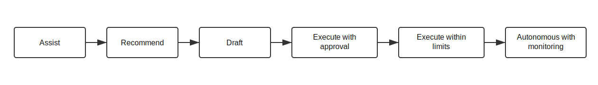

# Governed Autonomy Process Assessment

Use this assessment before introducing or expanding AI autonomy in a business process.

The goal is not to automate every step. The goal is to decide which steps can be delegated safely, which need human judgment, and which controls must exist before autonomy increases.

The assessment moves from the as-is process to the to-be process by making decision rights, handoffs, controls, evidence, and autonomy boundaries explicit.

## 1. Map The As-Is Process

Capture how work happens today:

- trigger
- requester
- current roles
- systems used
- handoffs
- approvals
- evidence produced
- common exceptions
- current pain points
- failure modes

## 2. Identify Decision Rights

For each decision, ask:

- who owns the decision today?
- who is accountable if it goes wrong?
- what policy, law, standard, or business rule constrains it?
- can the decision be recommended by AI, drafted by AI, or executed by AI?
- what would require human review?

## 3. Classify Autonomy Level

Use a simple ladder:

| Level | Pattern | Human role |
| --- | --- | --- |
| 1 | Assist | AI helps a human do the work |
| 2 | Recommend | AI proposes an option |
| 3 | Draft | AI prepares work for review |
| 4 | Execute with approval | AI acts only after explicit approval |
| 5 | Execute within limits | AI acts inside defined boundaries |
| 6 | Autonomous with monitoring | AI acts continuously with monitoring, audit, and escalation |

Do not skip levels for high-risk process steps.

## 4. Define The To-Be Process

For each step, define:

- role owner
- autonomy level
- allowed action
- required input
- required evidence
- escalation condition
- approval condition
- completion condition

## 5. Design Controls Into The Process

Controls should be part of the process design, not added after automation succeeds.

Controls may include:

- input quality gates
- authority limits
- dual approval
- evidence checklists
- policy checks
- audit sampling
- exception queues
- rollback or correction paths
- periodic review

## 6. Measure Outcomes

Measure both efficiency and control:

- cycle time
- rework
- escalation rate
- approval quality
- evidence completeness
- exception rate
- policy breaches
- user or citizen satisfaction
- cost-to-serve
- audit findings
