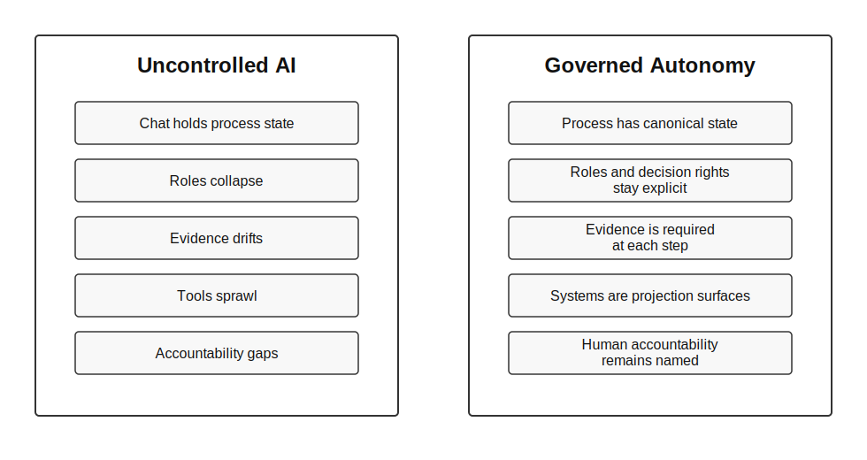

# Uncontrolled AI Risk Patterns

Governed Autonomy exists because uncontrolled AI does not merely produce bad answers. It can alter business processes faster than organizations can inspect, explain, or control.

These patterns are warning signs that autonomy is escaping the process design.

## Chat As A Control Plane

**What it looks like:** Important process state, decisions, approvals, and evidence live inside a chat thread rather than a governed system of record.

**Why it creates risk:** The organization cannot reliably see current state, inspect evidence, recover context, or prove who approved what.

**Governed Autonomy response:** Define a durable source of truth for process state. Use chat as an interaction surface, not the control plane.

## Unbounded Delegation

**What it looks like:** AI moves from advice to action without explicit limits on what it may do, where it may act, or when it must stop.

**Why it creates risk:** A helpful assistant becomes an uncontrolled operator.

**Governed Autonomy response:** Define authority boundaries, prohibited actions, escalation conditions, and approval points before granting tool access or execution rights.

## Role Collapse

**What it looks like:** One AI session silently becomes analyst, operator, designer, reviewer, approver, and auditor.

**Why it creates risk:** Separation of duties disappears. The same system that proposes an action can also approve and mark it complete.

**Governed Autonomy response:** Preserve named roles and decision rights. AI may assist several roles, but it must not erase their accountability boundaries.

## Evidence Drift

**What it looks like:** Actions happen faster than evidence is captured. Rationale, source data, checks, and approvals are reconstructed after the fact.

**Why it creates risk:** Review becomes guesswork and auditability collapses.

**Governed Autonomy response:** Make evidence a required output of each governed step.

## Approval Theater

**What it looks like:** Humans approve large bundles of AI-generated work without clear evidence, alternatives, risk summary, or scope boundary.

**Why it creates risk:** Human oversight exists formally but not substantively.

**Governed Autonomy response:** Require approvals at meaningful transitions with enough context to support a real decision.

## Tool Sprawl

**What it looks like:** Autonomous work touches many systems, but no one can tell which system holds canonical process state.

**Why it creates risk:** Planning, execution, review, and reporting drift apart.

**Governed Autonomy response:** Assign canonical state deliberately and treat other tools as projection or collaboration surfaces unless explicitly designed otherwise.

## Accountability Gaps

**What it looks like:** When an AI-driven action causes harm or confusion, no named owner can explain the decision or accept responsibility for correction.

**Why it creates risk:** Accountability moves from people and roles to an opaque system.

**Governed Autonomy response:** Keep a human role accountable for every delegated process step.

## Scope Creep At Machine Speed

**What it looks like:** A narrow request expands into broader operational change because the AI infers additional tasks and executes them.

**Why it creates risk:** The organization loses control of change boundaries.

**Governed Autonomy response:** Define scope, non-goals, stop conditions, and boundary-reset triggers.

## Post-Hoc Governance

**What it looks like:** Controls are added only after an AI workflow already exists and has started producing operational effects.

**Why it creates risk:** Governance becomes cleanup rather than design.

**Governed Autonomy response:** Design controls into the process before increasing autonomy.
