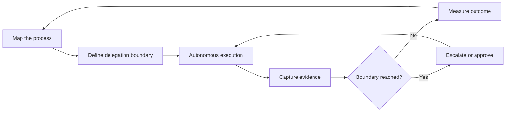
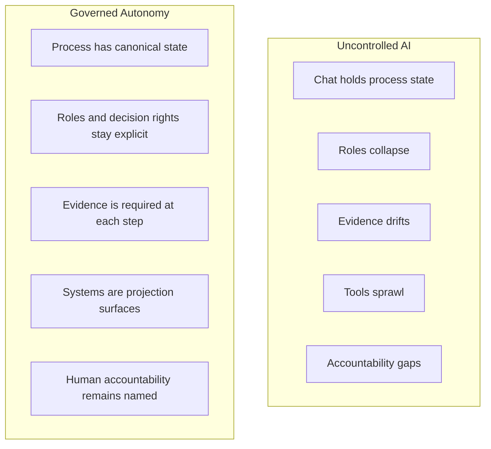
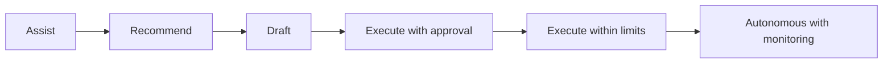
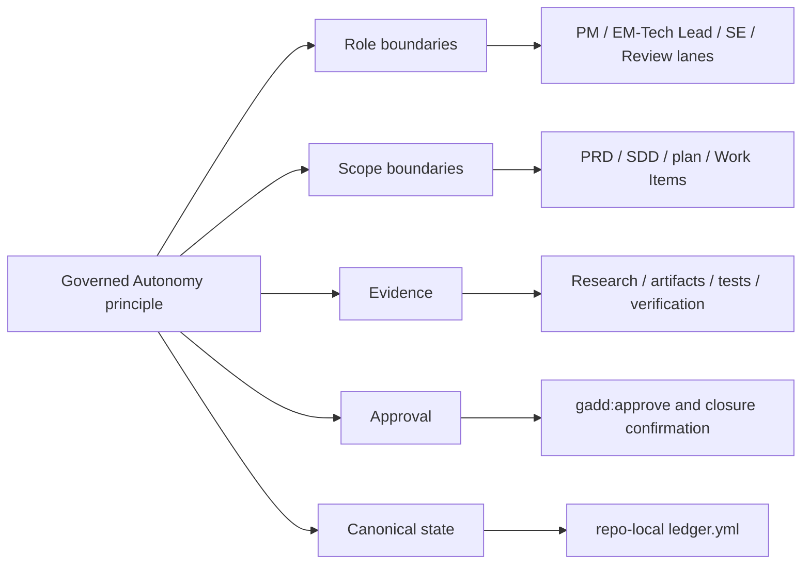

# Governed Autonomy Docs Implementation Plan

> **For agentic workers:** REQUIRED SUB-SKILL: Use superpowers:subagent-driven-development (recommended) or superpowers:executing-plans to implement this plan task-by-task. Steps use checkbox (`- [ ]`) syntax for tracking.

**Goal:** Build a serious Governed Autonomy documentation section that frames it as a business-process discipline for mitigating uncontrolled AI risk, with GADD as a software-delivery case study.

**Architecture:** Add a dedicated `docs/governed-autonomy/` directory with focused pages for philosophy, operating model, process assessment, risk patterns, GADD case study, related landscape, references, and explanatory visual assets. Keep root project docs as navigation and scope-setting surfaces only; do not turn the repo into a docs site or use GitHub Wiki/Pages.

**Tech Stack:** Markdown documentation, Mermaid source diagrams, rendered SVG assets, existing GADD docs validator (`python3 scripts/validate-gadd-docs.py`), optional full repo validation (`./scripts/validate-gadd-mvp.sh`).

---

## File Structure

- Create `docs/governed-autonomy/README.md`
  - Philosophy entry point.
  - Starts with ELI5.
  - Defines Governed Autonomy as a business-process discipline.
  - Links to the rest of the section.

- Create `docs/governed-autonomy/operating-model.md`
  - Reusable operating model.
  - Covers roles, decision rights, authority, gates, evidence, escalation, approval, state, auditability, proportional governance, and projection into existing systems.

- Create `docs/governed-autonomy/process-assessment.md`
  - Business-analysis/process-improvement assessment guide.
  - Uses as-is/to-be, handoffs, decision rights, controls, autonomy levels, and measurement language.

- Create `docs/governed-autonomy/uncontrolled-ai-risk-patterns.md`
  - Names and explains uncontrolled AI business-risk patterns.
  - Each pattern includes what it looks like, why it matters, and the Governed Autonomy response.

- Create `docs/governed-autonomy/case-study-gadd.md`
  - Maps Governed Autonomy principles onto GADD.
  - Explicitly says GADD is one implementation for software delivery, not the full scope of Governed Autonomy.

- Create `docs/governed-autonomy/related-landscape.md`
  - Situates Governed Autonomy near Responsible AI, AI governance, AI management systems, agentic AI governance, agentic BPM, AI operating models, and process improvement.

- Create `docs/governed-autonomy/references.md`
  - Annotated reference list with links and short summaries.
  - No long quotations.

- Create `docs/governed-autonomy/assets/governed-autonomy-loop.mmd`
- Create `docs/governed-autonomy/assets/governed-autonomy-loop.svg`
- Create `docs/governed-autonomy/assets/uncontrolled-ai-vs-governed-autonomy.mmd`
- Create `docs/governed-autonomy/assets/uncontrolled-ai-vs-governed-autonomy.svg`
- Create `docs/governed-autonomy/assets/business-process-autonomy-ladder.mmd`
- Create `docs/governed-autonomy/assets/business-process-autonomy-ladder.svg`
- Create `docs/governed-autonomy/assets/gadd-case-study-map.mmd`
- Create `docs/governed-autonomy/assets/gadd-case-study-map.svg`
  - Mermaid source is canonical for maintainability.
  - SVG is committed so GitHub readers see diagrams without local tooling.

- Modify `README.md`
  - Add a short Governed Autonomy link near the opening or under "More Detail."
  - Keep installation and command catalog unchanged.

- Modify `CONTEXT.md`
  - Broaden the first paragraph so Governed Autonomy is not software-only.
  - Preserve GADD's current software-delivery scope.

- Modify `docs/workflow.md`
  - Add one pointer back to `docs/governed-autonomy/README.md`.
  - Keep the page about GADD workflow mechanics.

---

### Task 1: Create The Governed Autonomy Directory And Entry Page

**Files:**
- Create: `docs/governed-autonomy/README.md`

- [ ] **Step 1: Create the directory**

Run:

```bash
mkdir -p docs/governed-autonomy
```

Expected: command exits with status `0`.

- [ ] **Step 2: Add the entry page**

Create `docs/governed-autonomy/README.md` with this structure and content direction:

```markdown
# Governed Autonomy

Governed Autonomy is a business-process discipline for the AI transformation era.

It starts from a simple idea: organizations can delegate more work to autonomous systems only when accountability, authority, scope, evidence, escalation, approval, and closure boundaries remain explicit.

Governed Autonomy is not a claim that business process management, Responsible AI, risk management, auditability, or operating model design are new. It is a practical lens for applying those existing disciplines when autonomous systems start performing work inside business processes.

## ELI5

Governed Autonomy means letting AI or automated systems help do work while making sure people still decide what matters, know what happened, can inspect the evidence, and approve important steps.

It is not "let the AI do everything." It is "decide what the AI may do, what it must prove, when it must stop, and who remains accountable."

## Why This Matters

AI transformation is often treated as task automation. That misses the larger risk: uncontrolled AI can change how work flows through an organization without accountable process control.

The better question is not "can AI do this task?" The better question is:

> Can this business process safely delegate this step under defined boundaries, with enough evidence, escalation, and approval?

That makes Governed Autonomy a synthesis, not a replacement for existing governance or process-improvement disciplines.

## The Business Process Is The Unit Of Design

Governed Autonomy is not tied to one industry. It applies wherever work moves through a process: approvals, case handling, compliance review, procurement, service requests, incident response, change management, planning, support, and internal operations.

The work is to understand the process, decide where autonomy can participate, and design the controls that keep humans accountable for purpose, risk, and outcome.

## What Must Stay Governed

- Purpose: what the process is trying to achieve.
- Authority: who or what is allowed to act.
- Scope: what is inside and outside the delegated work.
- Evidence: what must be recorded so decisions can be reviewed.
- Escalation: when the autonomous system must stop or ask for help.
- Approval: which transitions need explicit human consent.
- Closure: how completion is verified and accepted.

## Where GADD Fits

GADD is the first documented case study in this repository: a software-delivery methodology that applies Governed Autonomy to intake, requirements, design, planning, implementation, verification, and closure.

GADD does not define the full scope of Governed Autonomy. It shows how the philosophy becomes concrete in one complex business process.

## Read Next

- [Operating Model](operating-model.md)
- [Process Assessment](process-assessment.md)
- [Uncontrolled AI Risk Patterns](uncontrolled-ai-risk-patterns.md)
- [GADD Case Study](case-study-gadd.md)
- [Related Landscape](related-landscape.md)
- [References](references.md)
```

- [ ] **Step 3: Review the entry page for forbidden narrowing**

Run:

```bash
rg -n "software-delivery discipline|software-only|GADD is Governed Autonomy|industry-specific" docs/governed-autonomy/README.md
```

Expected: no matches.

- [ ] **Step 4: Commit Task 1**

Run:

```bash
git add docs/governed-autonomy/README.md
git commit -m "docs: introduce governed autonomy"
```

Expected: commit succeeds.

---

### Task 2: Add The Operating Model And Process Assessment Pages

**Files:**
- Create: `docs/governed-autonomy/operating-model.md`
- Create: `docs/governed-autonomy/process-assessment.md`

- [ ] **Step 1: Create `operating-model.md`**

Create `docs/governed-autonomy/operating-model.md` with this structure:

```markdown
# Governed Autonomy Operating Model

The operating model turns Governed Autonomy from a principle into a repeatable way to design, improve, and govern business processes that include AI or autonomous systems.

The value is not that AI does work. The value is that autonomous execution becomes governable at organizational scale.

## 1. Roles And Decision Rights

Name the roles in the process before assigning autonomy.

- Process owner: accountable for process outcomes.
- Domain owner: accountable for policy, service, or business correctness.
- Operator: performs or supervises work.
- Reviewer: checks evidence and quality.
- Approver: authorizes a governed transition.
- Auditor or assurance role: inspects traceability after the fact.
- Autonomous system: executes bounded work but does not own accountability.

For each role, define what it can decide, what it can delegate, and what it must escalate.

## 2. Authority Boundaries

Authority boundaries define what an autonomous system may do without further approval.

Document:

- allowed actions
- prohibited actions
- spending, risk, policy, or customer-impact limits
- systems the autonomous system may read or write
- conditions that require human intervention

## 3. Input Quality Gates

A process step should not start just because a prompt exists.

Define the minimum input needed for safe action:

- source of request
- desired outcome
- constraints
- relevant records
- sensitivity or policy concerns
- known risks
- owner or approver

Weak input should route to clarification, research, or human decision rather than silent execution.

## 4. Scope And Execution Boundaries

Boundaries prevent a narrow request from expanding into unmanaged operational change.

Each delegated step should state:

- what is in scope
- what is out of scope
- what assumptions are allowed
- what changes require a boundary reset
- when the system must stop

## 5. Risk And Blast Radius

Autonomy should be proportional to risk.

Assess:

- customer or citizen impact
- financial impact
- legal, regulatory, or policy exposure
- reversibility
- data sensitivity
- operational dependency
- reputational risk
- cross-team or cross-system impact

Higher blast radius requires stronger evidence, approvals, monitoring, and rollback paths.

## 6. Evidence Requirements

Governed autonomy requires evidence that can be reviewed.

Evidence may include:

- input received
- data sources consulted
- assumptions made
- decision rationale
- action taken
- system changes made
- checks performed
- escalation or approval records
- final outcome

## 7. Escalation And Approval

Escalation and approval are different.

Escalation means the autonomous system has reached a boundary and needs help. Approval means an accountable human authorizes a transition or action.

Define both before deployment.

## 8. State And Auditability

Important process state should not live only in chat.

Governed processes need a durable source of truth for current state, evidence, approvals, and closure. Existing systems can remain collaboration surfaces, but the process must make clear which record is canonical.

## 9. Projection Into Existing Systems

Governed Autonomy should usually work with the tools an organization already uses.

Planning systems, ticketing systems, case-management tools, spreadsheets, workflow platforms, and documents can project status and review information. They should not become accidental sources of truth unless the operating model explicitly assigns that role.
```

- [ ] **Step 2: Create `process-assessment.md`**

Create `docs/governed-autonomy/process-assessment.md` with this structure:

```markdown
# Governed Autonomy Process Assessment

Use this assessment before introducing or expanding AI autonomy in a business process.

The goal is not to automate every step. The goal is to decide which steps can be delegated safely, which need human judgment, and which controls must exist before autonomy increases.

## 1. Map The As-Is Process

Capture how work happens today:

- trigger
- requester
- current roles
- systems used
- handoffs
- approvals
- evidence produced
- common exceptions
- current pain points
- failure modes

## 2. Identify Decision Rights

For each decision, ask:

- who owns the decision today?
- who is accountable if it goes wrong?
- what policy, law, standard, or business rule constrains it?
- can the decision be recommended by AI, drafted by AI, or executed by AI?
- what would require human review?

## 3. Classify Autonomy Level

Use a simple ladder:

| Level | Pattern | Human role |
| --- | --- | --- |
| 1 | Assist | AI helps a human do the work |
| 2 | Recommend | AI proposes an option |
| 3 | Draft | AI prepares work for review |
| 4 | Execute with approval | AI acts only after explicit approval |
| 5 | Execute within limits | AI acts inside defined boundaries |
| 6 | Autonomous with monitoring | AI acts continuously with monitoring, audit, and escalation |

Do not skip levels for high-risk process steps.

## 4. Define The To-Be Process

For each step, define:

- role owner
- autonomy level
- allowed action
- required input
- required evidence
- escalation condition
- approval condition
- completion condition

## 5. Design Controls Into The Process

Controls should be part of the process design, not added after automation succeeds.

Controls may include:

- input quality gates
- authority limits
- dual approval
- evidence checklists
- policy checks
- audit sampling
- exception queues
- rollback or correction paths
- periodic review

## 6. Measure Outcomes

Measure both efficiency and control:

- cycle time
- rework
- escalation rate
- approval quality
- evidence completeness
- exception rate
- policy breaches
- user or citizen satisfaction
- cost-to-serve
- audit findings
```

- [ ] **Step 3: Check terminology alignment**

Run:

```bash
rg -n "as-is|to-be|decision rights|handoffs|controls|business process|blast radius" docs/governed-autonomy/operating-model.md docs/governed-autonomy/process-assessment.md
```

Expected: matches appear across both files.

- [ ] **Step 4: Commit Task 2**

Run:

```bash
git add docs/governed-autonomy/operating-model.md docs/governed-autonomy/process-assessment.md
git commit -m "docs: define governed autonomy operating model"
```

Expected: commit succeeds.

---

### Task 3: Add Risk Patterns, Related Landscape, And References

**Files:**
- Create: `docs/governed-autonomy/uncontrolled-ai-risk-patterns.md`
- Create: `docs/governed-autonomy/related-landscape.md`
- Create: `docs/governed-autonomy/references.md`

- [ ] **Step 1: Create `uncontrolled-ai-risk-patterns.md`**

Create `docs/governed-autonomy/uncontrolled-ai-risk-patterns.md` with this exact page shape:

```markdown
# Uncontrolled AI Risk Patterns

Governed Autonomy exists because uncontrolled AI does not merely produce bad answers. It can alter business processes faster than organizations can inspect, explain, or control.

These patterns are warning signs that autonomy is escaping the process design.

## Chat As A Control Plane

**What it looks like:** Important process state, decisions, approvals, and evidence live inside a chat thread rather than a governed system of record.

**Why it creates risk:** The organization cannot reliably see current state, inspect evidence, recover context, or prove who approved what.

**Governed Autonomy response:** Define a durable source of truth for process state. Use chat as an interaction surface, not the control plane.

## Unbounded Delegation

**What it looks like:** AI moves from advice to action without explicit limits on what it may do, where it may act, or when it must stop.

**Why it creates risk:** A helpful assistant becomes an uncontrolled operator.

**Governed Autonomy response:** Define authority boundaries, prohibited actions, escalation conditions, and approval points before granting tool access or execution rights.

## Role Collapse

**What it looks like:** One AI session silently becomes analyst, operator, designer, reviewer, approver, and auditor.

**Why it creates risk:** Separation of duties disappears. The same system that proposes an action can also approve and mark it complete.

**Governed Autonomy response:** Preserve named roles and decision rights. AI may assist several roles, but it must not erase their accountability boundaries.

## Evidence Drift

**What it looks like:** Actions happen faster than evidence is captured. Rationale, source data, checks, and approvals are reconstructed after the fact.

**Why it creates risk:** Review becomes guesswork and auditability collapses.

**Governed Autonomy response:** Make evidence a required output of each governed step.

## Approval Theater

**What it looks like:** Humans approve large bundles of AI-generated work without clear evidence, alternatives, risk summary, or scope boundary.

**Why it creates risk:** Human oversight exists formally but not substantively.

**Governed Autonomy response:** Require approvals at meaningful transitions with enough context to support a real decision.

## Tool Sprawl

**What it looks like:** Autonomous work touches many systems, but no one can tell which system holds canonical process state.

**Why it creates risk:** Planning, execution, review, and reporting drift apart.

**Governed Autonomy response:** Assign canonical state deliberately and treat other tools as projection or collaboration surfaces unless explicitly designed otherwise.

## Accountability Gaps

**What it looks like:** When an AI-driven action causes harm or confusion, no named owner can explain the decision or accept responsibility for correction.

**Why it creates risk:** Accountability moves from people and roles to an opaque system.

**Governed Autonomy response:** Keep a human role accountable for every delegated process step.

## Scope Creep At Machine Speed

**What it looks like:** A narrow request expands into broader operational change because the AI infers additional tasks and executes them.

**Why it creates risk:** The organization loses control of change boundaries.

**Governed Autonomy response:** Define scope, non-goals, stop conditions, and boundary-reset triggers.

## Post-Hoc Governance

**What it looks like:** Controls are added only after an AI workflow already exists and has started producing operational effects.

**Why it creates risk:** Governance becomes cleanup rather than design.

**Governed Autonomy response:** Design controls into the process before increasing autonomy.
```

- [ ] **Step 2: Create `references.md`**

Create `docs/governed-autonomy/references.md` with these initial annotated links:

```markdown
# Governed Autonomy References

This page collects adjacent standards, principles, research, and market writing that informed the Governed Autonomy documentation.

Governed Autonomy is not presented here as an exclusively owned term or a wholly new philosophy. The phrase and related ideas already appear in AI-governance discussions, and its ingredients already exist across business process management, Responsible AI, risk management, auditability, operating model design, and human oversight. The distinctive emphasis in this repository is the business process as the unit of design under AI autonomy pressure.

## Standards And Principles

- [ISO/IEC 42001: Artificial intelligence management system](https://www.iso.org/standard/81230.html) - Management-system framing for organizational AI governance, policies, processes, risk treatment, roles, and continual improvement.
- [NIST AI Risk Management Framework](https://www.nist.gov/itl/ai-risk-management-framework) - Risk framing for AI systems, including governance, mapping, measurement, and management of AI risks.
- [OECD AI Principles](https://oecd.ai/en/ai-principles) - International principles covering human-centered values, transparency, robustness, accountability, and responsible stewardship.

## Agentic AI Governance

- [IBM: An agentic AI governance playbook](https://www.ibm.com/think/insights/agentic-ai-governance-playbook) - Practical discussion of governing AI agents as systems that take actions, including ownership, authority, boundaries, escalation, monitoring, and accountability.

## Business Process And Operating Model Research

- [Agentic Business Process Management](https://arxiv.org/abs/2504.03693) - Research direction for autonomy and collaboration inside business process management.
- [Governing the Agentic Enterprise](https://cmr.berkeley.edu/2026/03/governing-the-agentic-enterprise-a-new-operating-model-for-autonomous-ai-at-scale/) - Operating-model framing for autonomous AI at organizational scale.
- [AI agents in government: ensuring responsible and accountable autonomous systems in public service](https://arxiv.org/abs/2506.04836) - Public-sector-focused discussion of oversight, auditability, operational visibility, and coordination challenges.

## Market Direction

- [SAP: The future enterprise is autonomous](https://news.sap.com/2026/05/future-enterprise-autonomous/) - Vendor framing around agents anchored in business processes, governance, approval flows, compliance, identity, and auditability.
```

- [ ] **Step 3: Create `related-landscape.md`**

Create `docs/governed-autonomy/related-landscape.md` with this structure:

```markdown
# Related Landscape

Governed Autonomy sits near several established and emerging disciplines. It should be understood as part of the broader AI transformation and business-process governance landscape, not as a replacement for those disciplines.

The position is deliberately modest: Governed Autonomy is a synthesis lens. It names the practical work of applying existing governance, process, risk, and operating-model disciplines to business processes where autonomous systems are beginning to perform work.

## Responsible AI

Responsible AI focuses on values, safety, fairness, transparency, robustness, and accountability in AI systems.

Governed Autonomy builds on that concern but asks a process question: how does an autonomous system participate in a business process without dissolving human accountability?

## AI Governance And AI Management Systems

AI governance and AI management systems define organizational policies, roles, risk controls, monitoring, and improvement practices for AI.

Governed Autonomy operates at the process-design level. It asks where autonomy belongs, what boundaries it needs, and what evidence must exist for safe delegation.

## Agentic AI Governance

Agentic AI governance focuses on AI systems that can take actions through tools, workflows, and external systems.

Governed Autonomy treats action governance as a business-process design problem. Tool access is not enough; authority, scope, escalation, evidence, and approval must be designed into the work.

## Agentic Business Process Management

Agentic business process management explores how AI agents can participate in, adapt, or coordinate business processes.

Governed Autonomy is compatible with this direction, but it emphasizes accountable control. The process may become more autonomous, but it must not become less governable.

## Business Analysis And Process Improvement

Business analysis and process improvement provide the practical language of as-is process, to-be process, handoffs, decision rights, controls, measures, and outcomes.

Governed Autonomy uses that language for AI transformation. It does not start with the model. It starts with the process.

## Distinction

Governed Autonomy centers the business process as the unit of design. It asks how autonomous systems participate in a process without dissolving human accountability, evidence, escalation, and approval boundaries.

Its useful contribution is not claiming that controls, decision rights, evidence, or escalation are new. Its contribution is making those ideas operational when AI systems can move from recommendation to action inside real processes.
```

- [ ] **Step 4: Validate no long copied passages**

Run:

```bash
wc -w docs/governed-autonomy/references.md docs/governed-autonomy/related-landscape.md
```

Expected: output shows concise files. Manually confirm references are summaries, not copied source text.

- [ ] **Step 5: Commit Task 3**

Run:

```bash
git add docs/governed-autonomy/uncontrolled-ai-risk-patterns.md docs/governed-autonomy/related-landscape.md docs/governed-autonomy/references.md
git commit -m "docs: map uncontrolled ai risk patterns"
```

Expected: commit succeeds.

---

### Task 4: Add GADD Case Study And Visual Assets

**Files:**
- Create: `docs/governed-autonomy/case-study-gadd.md`
- Create: `docs/governed-autonomy/assets/governed-autonomy-loop.mmd`
- Create: `docs/governed-autonomy/assets/governed-autonomy-loop.svg`
- Create: `docs/governed-autonomy/assets/uncontrolled-ai-vs-governed-autonomy.mmd`
- Create: `docs/governed-autonomy/assets/uncontrolled-ai-vs-governed-autonomy.svg`
- Create: `docs/governed-autonomy/assets/business-process-autonomy-ladder.mmd`
- Create: `docs/governed-autonomy/assets/business-process-autonomy-ladder.svg`
- Create: `docs/governed-autonomy/assets/gadd-case-study-map.mmd`
- Create: `docs/governed-autonomy/assets/gadd-case-study-map.svg`

- [ ] **Step 1: Create the assets directory**

Run:

```bash
mkdir -p docs/governed-autonomy/assets
```

Expected: command exits with status `0`.

- [ ] **Step 2: Create `case-study-gadd.md`**

Create `docs/governed-autonomy/case-study-gadd.md` with this structure:

```markdown
# Case Study: GADD

GADD is a case study in Governed Autonomy applied to software delivery.

It does not define the full scope of Governed Autonomy. It shows how the philosophy can become a concrete methodology for one complex business process: moving software work from intake to verified closure.

## Business Process

GADD governs the software-delivery process from unclassified intake through requirements, design, planning, implementation, verification, closure, and optional archive cleanup.

## Roles

| Governed Autonomy concern | GADD expression |
| --- | --- |
| Process owner | Team or organization adopting GADD |
| Product authority | Product Manager and Product Requirement lane |
| Technical authority | EM, Tech Lead, Architect, and Technical Design lane |
| Operator | Software Engineer and `/gadd:implement` |
| Reviewer | Engineering Review and `/gadd:verify` |
| Approver | Human approval through `/gadd:approve` and closure confirmation |
| Autonomous system | Agent executing bounded `/gadd:*` skills |

## Boundaries

GADD keeps boundaries explicit through:

- triage outcomes
- Product Requirement scope
- Software Design Documents
- implementation plans
- child Work Items
- verification reports
- closure decisions

Each boundary defines what the agent may do next and what evidence or approval is required before progression.

## Evidence

GADD uses repo-local artifacts as evidence:

- `ledger.yml` for canonical workflow state
- `research.md` where pre-scope investigation is needed
- `prd.md` for product scope
- `sdd.md` for technical design
- `plan.md` and `plan.html` for implementation planning
- child Work Item files for vertical slices
- implementation evidence from code, tests, and documentation impact
- `verification.md` for closure readiness

## Existing Systems

GADD treats external planning and review tools as projection surfaces unless explicitly configured otherwise.

GitHub Issues, Jira, Linear, Asana, and similar systems can be useful collaboration surfaces, but GADD's repo-local ledger remains canonical workflow state in the current model.

## Risk Mitigation

| Uncontrolled AI risk | GADD mitigation |
| --- | --- |
| Chat as a control plane | `ledger.yml` stores canonical workflow state |
| Unbounded delegation | `/gadd:*` skills have command-specific contracts and input gates |
| Role collapse | Product, design, implementation, verification, and closure are separate lanes |
| Evidence drift | PRD, SDD, plan, Work Item, and verification artifacts record evidence |
| Approval theater | `/gadd:approve` approves specific PRD, SDD, or plan gates |
| Tool sprawl | external systems are projections, not hidden sources of truth |
| Scope creep at machine speed | scope gates and decomposition boundaries reset unauthorized expansion |

## What This Shows

GADD demonstrates the Governed Autonomy pattern in a domain where autonomous execution can otherwise collapse planning, design, implementation, and review into one chat loop.

The broader lesson is not software-specific: autonomy becomes safer when the process defines roles, boundaries, evidence, escalation, approval, and canonical state before execution accelerates.
```

- [ ] **Step 3: Create Mermaid source for Governed Autonomy Loop**

Create `docs/governed-autonomy/assets/governed-autonomy-loop.mmd`:



- [ ] **Step 4: Create Mermaid source for Uncontrolled AI vs Governed Autonomy**

Create `docs/governed-autonomy/assets/uncontrolled-ai-vs-governed-autonomy.mmd`:



- [ ] **Step 5: Create Mermaid source for Business Process Autonomy Ladder**

Create `docs/governed-autonomy/assets/business-process-autonomy-ladder.mmd`:



- [ ] **Step 6: Create Mermaid source for GADD Case Study Map**

Create `docs/governed-autonomy/assets/gadd-case-study-map.mmd`:



- [ ] **Step 7: Render SVG diagrams**

If Mermaid CLI is available, run:

```bash
mmdc -i docs/governed-autonomy/assets/governed-autonomy-loop.mmd -o docs/governed-autonomy/assets/governed-autonomy-loop.svg
mmdc -i docs/governed-autonomy/assets/uncontrolled-ai-vs-governed-autonomy.mmd -o docs/governed-autonomy/assets/uncontrolled-ai-vs-governed-autonomy.svg
mmdc -i docs/governed-autonomy/assets/business-process-autonomy-ladder.mmd -o docs/governed-autonomy/assets/business-process-autonomy-ladder.svg
mmdc -i docs/governed-autonomy/assets/gadd-case-study-map.mmd -o docs/governed-autonomy/assets/gadd-case-study-map.svg
```

Expected: four SVG files are created.

If Mermaid CLI is unavailable, create simple hand-authored SVG files that match the Mermaid diagrams exactly in meaning. Keep the Mermaid source canonical and commit both `.mmd` and `.svg`.

- [ ] **Step 8: Embed diagrams into relevant pages**

Add these image links:

In `docs/governed-autonomy/README.md`, after "What Must Stay Governed":

```markdown

```

In `docs/governed-autonomy/uncontrolled-ai-risk-patterns.md`, after the opening paragraph:

```markdown

```

In `docs/governed-autonomy/process-assessment.md`, after "Classify Autonomy Level":

```markdown

```

In `docs/governed-autonomy/case-study-gadd.md`, after the opening section:

```markdown

```

- [ ] **Step 9: Commit Task 4**

Run:

```bash
git add docs/governed-autonomy
git commit -m "docs: add governed autonomy case study visuals"
```

Expected: commit succeeds.

---

### Task 5: Update Existing Navigation And Domain Language

**Files:**
- Modify: `README.md`
- Modify: `CONTEXT.md`
- Modify: `docs/workflow.md`

- [ ] **Step 1: Update root `README.md` opening**

Change the current opening from:

```markdown
GADD is a governed autonomy methodology for AI-assisted software delivery.
```

To:

```markdown
GADD is a software-delivery methodology built on [Governed Autonomy](docs/governed-autonomy/README.md): the business-process discipline of delegating work to autonomous systems while keeping accountability, authority, scope, evidence, escalation, approval, and closure boundaries explicit.
```

- [ ] **Step 2: Update root `README.md` More Detail section**

Add this bullet under "More Detail":

```markdown
- [docs/governed-autonomy/](docs/governed-autonomy/README.md) explains the broader Governed Autonomy philosophy, operating model, uncontrolled AI risk patterns, and the GADD case study.
```

- [ ] **Step 3: Update `CONTEXT.md` opening**

Change the first paragraph from:

```markdown
Governed Autonomy is the operating philosophy for AI-assisted work that keeps authority, scope, evidence, and approval boundaries explicit. GADD is the software-delivery methodology that applies that philosophy across triage, product scope, engineering design, planning, implementation, verification, and closure.
```

To:

```markdown
Governed Autonomy is the business-process discipline for delegating work to autonomous systems while keeping accountability, authority, scope, evidence, escalation, approval, and closure boundaries explicit. GADD is the software-delivery methodology that applies that philosophy across triage, product scope, engineering design, planning, implementation, verification, and closure.
```

- [ ] **Step 4: Update `docs/workflow.md` source-of-truth section**

After this paragraph:

```markdown
External trackers are optional review and sync surfaces. They are not canonical GADD state.
```

Add:

```markdown
GADD is a software-delivery application of [Governed Autonomy](governed-autonomy/README.md). The broader Governed Autonomy docs explain the business-process philosophy, operating model, uncontrolled AI risk patterns, and GADD case study.
```

- [ ] **Step 5: Check link paths**

Run:

```bash
rg -n "governed-autonomy" README.md CONTEXT.md docs/workflow.md docs/governed-autonomy
```

Expected: links appear in root README, workflow docs, and Governed Autonomy pages.

- [ ] **Step 6: Commit Task 5**

Run:

```bash
git add README.md CONTEXT.md docs/workflow.md
git commit -m "docs: link gadd to governed autonomy"
```

Expected: commit succeeds.

---

### Task 6: Validate And Polish The Documentation Set

**Files:**
- Modify as needed: `docs/governed-autonomy/*.md`
- Modify as needed: `README.md`
- Modify as needed: `CONTEXT.md`
- Modify as needed: `docs/workflow.md`

- [ ] **Step 1: Run docs validator**

Run:

```bash
python3 scripts/validate-gadd-docs.py
```

Expected:

```text
GADD documentation freshness validated
```

- [ ] **Step 2: Check broad framing**

Run:

```bash
rg -n "Governed Autonomy is.*software|Governed Autonomy.*software-only|GADD defines Governed Autonomy|exclusive ownership" README.md CONTEXT.md docs/governed-autonomy docs/workflow.md
```

Expected: no matches that imply Governed Autonomy is software-only or exclusively owned.

- [ ] **Step 3: Check synthesis positioning**

Run:

```bash
rg -n "wholly new|invented Governed Autonomy|replaces Responsible AI|replaces BPM|replaces risk management|replacement for those disciplines" docs/governed-autonomy README.md docs/workflow.md
```

Expected: no matches for invention or replacement claims. A match for "not as a replacement for those disciplines" in `related-landscape.md` is acceptable.

- [ ] **Step 4: Check GADD scope guardrails**

Run:

```bash
rg -n "GADD supports non-software|GADD supports local government|GADD integrates with Jira|GADD integrates with Asana|GADD integrates with Linear" docs/governed-autonomy README.md docs/workflow.md
```

Expected: no matches.

- [ ] **Step 5: Check references are concise**

Run:

```bash
wc -w docs/governed-autonomy/references.md docs/governed-autonomy/related-landscape.md
```

Expected: both files are concise enough to inspect manually. Review them and confirm no long copied passages appear.

- [ ] **Step 6: Check image references exist**

Run:

```bash
for f in docs/governed-autonomy/assets/*.svg docs/governed-autonomy/assets/*.mmd; do test -s "$f" || exit 1; done
```

Expected: command exits with status `0`.

- [ ] **Step 7: Run full MVP validation if time permits**

Run:

```bash
./scripts/validate-gadd-mvp.sh
```

Expected: validation passes. If it fails for reasons unrelated to docs, record the failure output and do not hide it.

- [ ] **Step 8: Final commit**

If polishing edits were needed, run:

```bash
git add README.md CONTEXT.md docs/workflow.md docs/governed-autonomy
git commit -m "docs: polish governed autonomy documentation"
```

Expected: commit succeeds if there are changes. If there are no changes, skip this commit.

---

## Self-Review Checklist

- Spec coverage: Tasks cover the dedicated docs directory, all seven pages, visual assets, README/CONTEXT/workflow updates, references, related landscape, GADD case study, and validation.
- Placeholder scan: No task uses unfinished-marker language. Each created page has concrete section content and expected checks.
- Scope check: The plan remains docs-only. It does not enable Pages, use Wiki, modify GADD command behavior, or claim non-software GADD support.
- Risk framing: The plan explicitly includes uncontrolled AI risk patterns and business-process language.
- Visual framing: The plan creates explanatory diagrams, not decorative images.
